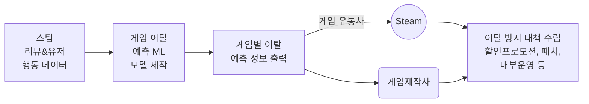

<div align="center"> 
Steam Top 50 Game Churn Prediction model <br>

# Steam 상위 50위 게임 장르별 이탈 예측 모델

</div>

------------------------------------------------------------------

</div>

## Team. 이탈밭지키미

<div align="center">
  
|||<Image src="https://github.com/user-attachments/assets/ef40d3ff-af29-42a4-833b-d0a64aa44cfd">|<Image src="https://github.com/user-attachments/assets/b892841c-78b3-4739-a5a9-83fc9d9625aa">|<Image src="https://github.com/user-attachments/assets/44605108-52d8-4ea7-89c6-82885419592e">|
|:--------:|:--------:|:--------:|:--------:|:-------:|
| 양창일 (팀장) | 강승원 | 이승연 | 송민채 | 김민정 |
| Data Engineer / FE / UI | PM / ML·DL Architect / PL | AL / ML | Threshold Analysis / ML | EDA / ML |
|[](https://github.com/clachic00)|[](https://github.com/chopa4452)|[](https://github.com/oooonbbo-wq)|[](https://github.com/minchaesong)|[](https://github.com/skn23-kmj)|


|이름| <div align="center"> 담당 업무 </div> |
|:------:|:-------------------------|
| 양창일 | 데이터 크롤링 / Feature Engineering / Streamlit UI 및 대시보드 구현 / 전체 시스템 통합 |
| 강승원 | 기술 구조 설계 및 데이터 파이프라인 구축 / ML·DL 모델 설계 및 평가 / AWS 서버 배포  |
| 이승연 | 분석 방향 설계 / Steam 이탈 정의 기준 수립 / 모델 초안 구축 / 모델 스토리라인 구성 / READ ME |
| 송민채 | 모델 초안 구축 / XGBoost·LightGBM 모델 학습 / 하이퍼파라미터 튜닝 / Threshold–Precision–Recall 분석 / EDA 시각화 |
| 김민정 | 모델 초안 구축 / 리뷰 사용자 행동 분석 / 이탈 예측용 파생 변수 설계 / Confusion Matrix 기반 성능 평가 및 시각화 |
</div>

--------------------------------------------

## 1. 프로젝트 기간

  

2026.01.14 ~ 2026.01.15

  

## 2. 프로젝트 개요

<div align="center">

<Image src="https://github.com/user-attachments/assets/6fcefba6-2de3-48bc-9fa4-89338c177e70">

</div>
<br>

이 프로젝트는 **Steam의 상위 50위 인기 게임을 대상**으로 하며, 유저 행동 및 리뷰 데이터를 기반으로 **각 게임의 유저 이탈(Churn) 위험을 예측하는 AI 분석 시스템**이다.
Steam은 PC 게임 시장의 약 70~75%를 차지하는 사실상 표준 유통 플랫폼이지만 현재 제공되는 지표는 동시 접속자 수, 매출, 리뷰 수 등 이미 발생한 결과를 보여주는 사후적 성과 지표에 집중되어 있다.

본 프로젝트는 이러한 한계를 보완하여, 상위 50위 게임을 중심으로 **장르 구조와 게임 특성을 고려한 이탈 위험을 사전에 예측하여**, 운영 개입과 의사결정을 지원할 수 있는 정량적 이탈 예측 지표를 제공하는 것을 목표로 한다.

### 2.1. 프로젝트 배경 및 목적

<div align="center">
  
  
  
  
</div>

  > 2023 Steam 신규 게임 플레이어 이탈률 그래프 / 2024 개별 게임 할인 행사에서 게임 트래픽 유도 효과가 5년전 대비 4배 감소 그래프
  
#### Steam 게임의 이탈률 증가
게임 업계 종사자가 공유한 분석에 따르면 신작 Steam 게임의 월평균 플레이어 이탈률이 과거보다 증가했으며, 이는 개발사와 퍼블리셔가 리텐션 데이터와 이탈률 데이터를 적극적으로 분석해야 한다는 시사점을 준다.


#### 플레이어 행동 변화와 경쟁 심화
최근 연구는 Steam 사용자 리뷰와 행동 데이터를 활용한 이탈 예측 모델이 게임사의 리텐션 전략 수립에 직접적인 가치를 제공함을 보여준다. 2024년 Steam 할인 행사에서 트래픽이 5년전 대비 4배 감소한 그래프와 함께 플레이어 행동 변화로 인해 이탈율 관리)이 게임 성과의 핵심 경쟁요소가 되었음을 지적하고 있다.

#### Steam 사용자 행동 기반 이탈률 모델의 필요성 
Steam 생태계는 매주 수백 개의 신작 출시와  DLC·시즌 패스·라이브 서비스 게임의 증가로 인해 수만 개의 게임이 동시에 유저의 관심과 체류 시간을 두고 경쟁하는 구조에 놓여 있다. 그러나 Steam이 현재 제공하는 지표는  동시 접속자 수, 매출, 리뷰 수 등 **사후적 성과 지표에 한정**되어 있어, 어떤 게임에서 사용자의 이탈이 발생하고 있는지,  그 이탈이 구조적 문제인지 운영 이슈인지를 **사전에 파악하기 어렵다**. 이로 인해 대응 시점을 놓칠 경우,  플랫폼 전체의 체류 시간·충성도·수익성 저하로 이어질 위험이 존재한다.

본 프로젝트는 이탈을 단순한 사후 결과가 아닌  **사전에 관리 가능한 예측 대상(Churn)** 으로 정의하고, 이를 예측하는 **ML·DL 분류 모델**을 구축하는 것을 목표로 한다. 특히 Steam 플랫폼 내 **리뷰 작성 사용자의 행동 데이터를 정량화**하여 사용자 이탈 가능성을 사전에 예측하고, 실제 서비스 환경에서 활용 가능한 **의사결정 기준과 인사이트**를 도출하고자 한다.
  

### 2.2. 프로젝트 목표

> Steam 상위 50위 인기 게임을 대상으로 하여 리뷰 및 유저 행동 데이터를 활용한 **게임 장르별 유저 이탈 예측 AI 분석 모델** 구축을 목표로 한다.



------------------------------------------------------------------

## 3. 모델 개발

### 3.1. 데이터셋
-  **데이터** : Steam API를 활용하여 게임 리뷰 및 유저 행동 데이터와 게임 정보 데이터 결합
-  **데이터 기간** : 2025-01-06 ~ 2026-01-06 (1년)
-  **데이터 수** : 4,813,221개
-  **특성 수** : 총 44개 (원본 변수 : 25개, 파생 변수 : 19개)
-  **타겟 변수** :`churn` (0: 유지, 1: 이탈)
-  **이탈률** : 29%

###  3.2. 타겟(이탈:Churn) 정의
  > 리뷰 작성 시점을 기준으로,  게임 스타일 별(video,online,story)로 정의된 기간 동안 **추가 플레이가 발생하지 않은 사용자**

1. 타겟 선정 이유 : 
	- Stream의 시장 지배력은 단순 사용자 수가 아닌 활동성과 충성도를 가진 핵심 정보 생산자에게 달려있다.
	- Steam의 핵심 정보 생산자인 **리뷰 작성 사용자**를 주요 타겟으로 설정한다.

2. 이탈(Churn) 기준
	- Steam 게임을 3가지 스타일별로 나누어 각 스타일별로 정의된 기간 동안 추가 플레이가 발생하지 않은 사용자를 이탈자로 구분한다.
	- 게임 스타일은 video,online,story 3가지로 분류한다. (GDC, Steam 태그 등 자료 참고하여 분류)

3. 게임 장르별 이탈 기준 차이

-  **online** : 단기 플레이 구조, 접속 빈도가 곧 서비스 인기 여부 결정, 짧은 공백을 실질적 이탈이라고 판단
-  **video** : 싱글 다회차 플레이 위주의 게임으로 휴식플레이를 고려하여 장기 미접속 시 이탈이라 판단
-  **story** : 엔딩 소비 후 콘텐츠 소비 종료, 이탈이 높더라도 부정적인 지표가 아닌 정상적인 소비 패턴

4. Window Label 생성 방식

<div align="center">
  
  
  


| 게임 스타일 | 게임 수 | 키워드                                     | 이탈 기준(Day) | 이탈률(%) |
|:---------:|:----------:|-----------------------------------------------|:----------:|:------:|
| <b>video</b>     | 21         | 다회차 플레이 / 싱글 & 멀티플레이 / 샌드박스형 | < 10         |35.1%|
| <b>online</b>    | 19         | 온라인 서버 운영 / 지속 접속형 / 서비스형     | < 7          |20.5%|
| <b>story</b>     | 10         | 일회성 / 엔딩 소비형 / 완결형                 | < 5          |40.6%|

</div>


### 3.3. 사용 모델과 선택 이유

1. **Logistic Regression** (`LogisticRegression`) : 기준 성능 확인 및 해석 목적

2. **LightGBM** (`LGBMClassifier`) : 비선형 관계 학습 및 핵심 변수 중요도 분석

3. **Histogram-based Gradient Boosting** (`HistGradientBoostingClassifier`) : 대규모 데이터 효율적 학습

### 3.4. EDA 요약

#### 3.4.1. 클래스 불균형 존재

1. 문제점
  - 유지(0) 0.713192 = 71.3% / 이탈(1) 0.286808  = 28.7%
	- 유지(0) 비율이 이탈(1)보다 높아서 클래스 불균형이 존재함

<div align="center">
    <Image src="https://github.com/user-attachments/assets/95e3666c-0cd3-4ae8-bda0-729843be3de0"
      width="400">
</div>


2. 대응 방법
- 평가 지표 전환 (Metric Selection) 
	- 불균형 데이터에 강한 F1-score 중심으로 평가 비교 분석
	- Confusion Matrix 기반 오류 유형(FP / FN) 분석
 - Threshold 조정
	  - Precision–Recall trade-off 분석 기반 최적값 선정
  - 2-Stage 전략 설계 (Recall → Precision)
	- Stage 1: Recall 중심 (이탈 유저 최대 탐지)
	- Stage 2: Precision 중심 (마케팅/리텐션 리소스 최적화)
	- 실질적인 의사결정 지표로 활용할 수 있도록 게임사에 정보 제공


#### 3.4.2. 변수 중요도 (Feature Importance : Tree-based Models)

>Tree 기반 모델(XGBoost, LightGBM)을 활용,   각 feature가 이탈 예측에 기여한 상대적 중요도를 분석한다.

1. 분석 방법
-   모델 학습 후 `feature_importances_` 기준 정렬
-   중요도 상위 변수 중심으로 해석

2.  주요 Feature Importance 결과
-   `playtime_forever`
-   `playtime_at_review`
-   `playtime_last_two_weeks`
-   `num_games_owned`
-   `num_reviews_author`
-   `appid`
    
3. 해석

-  플레이 타임 계열 변수들이 가장 높은 중요도를 보임   
-   리뷰 시점과 이후의 실제 행동 데이터가 이탈을 가장 잘 설명
-   단순 리뷰 정보보다 유저의 플레이 패턴이 결정적인 신호

#### 3.4.3. 데이터 누수 Feature 제거
1. 문제점
- 모델이 예측을 바로 알 수 있는 Feature로 학습
- 데이터 누수 발생

2. 대응 방법
- target 변수 관련 컬럼들 제거 `last_played` , `timestamp_created` , `timestamp_updated`, `days_after_review`
- review 시점 이후 시간 관련 칼럼들 제거 `playtime_last_two_weeks`, `playtime_forever`

3. 해석
- 데이터 누수의 원인으로 예측되는 컬럼들을 제거하여 모델 학습률을 안정화시킴
  
#### 3.4.4. Feature 상관관계 분석
1. 분석 방법

<div align="center">
    <Image src="https://github.com/user-attachments/assets/3adcdab8-0eae-4799-92e4-17578960a38d"
      width="400"> 
</div>

-   수치형 변수 대상 Pearson 상관계수 계산
-   상관관계 히트맵 시각화

2. 해석
- 선형 모델 사용 시 다중공선성 고려 필요
- Tree 기반 모델에서는 문제되지 않음
- 상관관계 분석을 통해  모델 선택(Tree 기반) 정당성 강화

#### 3.4.5. 다국어 리뷰를 활용한 이진화 파생 변수 설계

1. 분석 방법
- `review` 변수를 활용하여 다국어 리뷰 감성 이진화
- 긍정 리뷰 (Positive Review)
  - 예시 표현 : “재밌다”, “추천”, “갓겜”,“highly recommend”, “worth it”,“おすすめ”, “值得买”
  - 처리 방식 : `good_review` = 1

- 부정 리뷰 (Negative Review)
  - 예시 표현 : “비추”, “환불”, “노잼”,“not worth”, “refund”,“不推荐”
  - 처리 방식 : `good_review` = 0

2. 이탈 예측을 위한 이진화 파생 변수 설계
- 추천 감성과 플레이 타임이 불일치한 패턴을 파생변수로 생성
- `positive_but_short_play`
  - 긍정적인 리뷰를 남겼지만 플레이 타임이 적음 → 잠재적 이탈 위험 사용자
  - 처리 방식 : `positive_but_short_play` = 1
- `negative_but_short_play`
  - 부정적인 리뷰를 남겼지만 플레이 타임이 김 → 이탈 위험이 적은 사용자
  - 처리 방식 : `negative_but_short_play` = 1

3. 해석

<div align="center"> 
  <Image src="https://github.com/user-attachments/assets/7d0ece8d-75b4-44ae-8501-1d3474f8889c"
    width="400">

| 변수 | 유지(0) | 이탈(1)|
|:---:|:---:|:---:|
| 긍정 리뷰 + 낮은 플레이 타임 (positive_but_shot_play) | 28.6% | 54.2% |
| 부정 리뷰 + 높은 플레이 타임 (negative_but_long_play) | 33.1% | 23.4% |

</div>

- 긍정적 감정 + 짧은 플레이 타임 → 이탈 신호가 가장 강하게 관측됨

- 부정적 감정 + 긴 플레이 타임 → 이탈 신호가 상대적으로 약하게 관측됨


#### 3.4.6. 모델 학습 성능 향상을 위한 파생 Feature 추가 생성
1. 문제점
- 데이터 누수로 인한 Feature 삭제
- 모델이 학습할 Feature의 부족

2. 대응 방법

<div align="center">
    <Image src="https://github.com/user-attachments/assets/7f65e13b-b7e3-4172-8388-e6789de58250"
      width="400">
</div>

- 기존 데이터를 결합시켜 파생 Feature 생성
- 파생 변수에 쓰인 재료 컬럼들 제거 <br> `playtime_at_review`, `num_reviews_author`, `num_games_owned`, `votes_up`, `votes_funny`, `comment_count`

------------------------------------------------------------------

## 4. 모델 성능 테스트 계획 및 결과
### 4.1. 평가 지표
- **F1-score**
  - Recall 극대화 시 불필요한 대응 비용이 증가할 수 있으므로 Precision과 Recall의 균형을 고려한 F1-score를 평가지표로 사용
  - 클래스 불균형이 존재하는 이탈 예측 모델이기 때문에 불균형 데이터 환경에서 성능을 종합적으로 성능 확인

- **ROC-AUC & PR 곡선**
  - ROC-AUC : 모델이 이탈 유저와 비이탈 유저를 얼마나 잘 구분할 수 있는지를 나타내는 지표
임계값(Threshold)에 의존하지 않고 모델의 분리 능력을 평가할 수 있어, 서로 다른 모델(XGBoost, LightGBM, DL 등)을 공정하게 비교하는 기준으로 사용됨
  - PR 곡선 : 클래스 불균형 환경에서 데이터가 잘 구분되는지 모델인지 성능 확인

- **혼동항렬(Confusion Matrix)**
  - 이탈 유저 미탐지(FN)와 과잉 타겟팅(FP)의 **비대칭적 비용 구조** 반영
  - FN(이탈 유저)를 최소화하는 것을 최우선으로 목표로 함

<div align="center">

| 구분 | 의미 | 해석 |
|:---:|:---|:---|
| **TP** | 실제 이탈한 유저를 이탈로 예측 | 조기 대응 성공 |
| **FP** | 유지 유저를 이탈로 오판 | 불필요한 개입 |
| **FN** | 이탈 유저를 정상으로 판단 | 대응 기회 상실 |
| **TN** | 유지 유저를 정상으로 예측 | 정상 유지 |

</div>

### 4.2. 모델 성능 평가 결과
게임 이름: Where Winds Meet으로 성능 테스트 진행
<!-- Recall, precision, F1, ROC-AUC, 혼동항렬 결과 -->

#### 4.2.1. F1-Score 성능 비교
> F1-score 기준 비교 결과, **HistGradientBoosting 모델**이 대부분의 게임에서 가장 안정적인 이탈 예측 성능을 보였다.

<div align="center">
  <Image src="https://github.com/user-attachments/assets/c5bc146c-2b47-4464-9eb5-1641a53a43a9"
    width="700">
    
||모델명|게임 이름|Accuracy|Precision|Recall|F1-Score|
|:---:|:---:|:---:|:---:|:---:|:---:|:---:|
|0|HistGB|PEAK|0.7034|0.7156|0.9554|**0.8183**|
|1|HistGB|Detroit: Become Human|0.6568|0.6613|0.9652|**0.7848**|
|2|HistGB|Dispatch|0.6898|0.6959|0.8496|**0.7651**|
|3|LightGBM|Dispatch|0.6834|0.7064|0.7998|**0.7502**|
|4|Logistic|PEAK|0.6443|0.7646|0.7096|**0.7361**| 

</div>

- **비교 분류 모델** : `Logistic Regression` `LightGBM` `HistGradientBoosting`
- **테스트** : **F1-Score**
- **최고 성능 모델(★)** : 각 게임별로 가장 높은 F1-score를 기록한 `HistGradientBoosting`


#### 4.2.2. 혼동항렬 비교
> 이탈 유저를 놓치는 경우(FN)를 가장 최소화하는 방향으로 설계되었으며 조기 대응이 필요한 이탈 유저를 효과적으로 식별한다.

<div align="center">
  <Image src="https://github.com/user-attachments/assets/bcbcbb09-14ce-477f-8395-e2563c2459db"
    width="400">

|            구분           | 의미               |   본 모델 결과 | 해석                          |
| :---------------------: | :--------------- | --------: | :----------------------------- |
|  **TP** (True Positive) | 실제 이탈(1)을 이탈로 예측 | **4,220** | 이탈 유저를 사전에 식별 → **조기 대응 성공**   |
| **FP** (False Positive) | 실제 유지(0)를 이탈로 예측 | **3,509** | 이탈 오판 → **불필요한 마케팅/혜택 제공 가능성** |
| **FN** (False Negative) | 실제 이탈(1)을 유지로 예측 | **1,837** | 이탈을 놓침 → **대응 기회 상실** |
|  **TN** (True Negative) | 실제 유지(0)를 유지로 예측 | **9,160** | 정상 유저 유지 → **불필요한 개입 방지**      |

</div>

#### 4.2.3. ROC-AUC & PR 곡선
> ROC-AUC 곡선(AUC=0.78)은 모델이 이탈 유저와 유지 유저를 전반적으로 잘 구분하고 있음을 보여주며
> PR 곡선(AP=0.66)을  통해 클래스 불균형 환경에서도 비교적 안정적인 이탈 탐지 성능을 보임을 확인하였다.

<div align="center">
  
  
  

|지표 | 값 | 해석 |
|-- |--|--|
|ROC-AUC | 0.7816 | 이탈 유저와 유지 유저를 전반적으로 잘 구분하는 성능}
|PR (AP) | 0.6642 | 클래스 불균형 환경에서도 이탈 유저를 안정적으로 탐지|

</div>

### 4.3. 모델 성능 개선 및 발전

#### 4.3.1 성능 저하 게임 선별을 통한 단계별 모델 재학습 구조
> 성능 저하 게임 선별을 위한 재학습 구조 프로세스

<div align="center">
  
</div>

#### 4.3.2. 1차 성능 저하 게임 선별 학습
> 1차 학습 모델의 성능을 평가한 결과 요약표 (세부 지표는 전체 결과 파일 참고)

<div align="center">

|   appid | model    |  n_rows | churn_rate | train_auc | train_f1 | test_auc | test_f1 |
| ------: | -------- | ------: | ---------: | --------: | -------: | -------: | ------: |
| 3527290 | HistGB   |  31,721 |      0.699 |     0.693 |    0.826 |    0.651 |   0.818 |
| 1222140 | HistGB   |  64,366 |      0.649 |     0.639 |    0.788 |    0.615 |   0.785 |
| 2592160 | HistGB   | 150,629 |      0.595 |     0.717 |    0.770 |    0.707 |   0.765 |

**1차 모델 성능 평가 전체 결과:** [learning_first.csv](/SKN23-2nd-1Team/data/learning_first.csv) <br>

</div>

#### 4.3.3. 2차 성능 저하 게임 선별 재학습
> 2차 학습 모델의 성능을 평가한 결과 요약표 (세부 지표는 전체 결과 파일 참고)

<div align="center">

|   appid | model    |  n_rows | churn_rate | best_thr | train_f1 | test_f1 |
| ------: | -------- | ------: | ---------: | -------: | -------: | ------: |
| 1086940 | LightGBM | 105,187 |      0.299 |     0.44 |    0.496 |   0.486 |
|  526870 | HistGB   |  40,282 |      0.310 |     0.24 |    0.495 |   0.485 |
|  230410 | HistGB   |  48,982 |      0.204 |     0.24 |    0.503 |   0.478 |


**2차 성능 테스트 결과표** : [learning_second.csv](/SKN23-2nd-1Team/data/learning_second.csv) <br>

</div>

#### 4.3.4. 3차 성능 저하 게임 선별 재학습
> 3차 학습 모델의 성능을 평가한 결과 요약표 (세부 지표는 전체 결과 파일 참고)

<div align="center">

|   appid | best_model   |  n_rows | churn_rate | best_threshold | cv_best_f1 | train_f1 | test_f1 |
| ------: | ------------ | ------: | ---------: | -------------: | ---------: | -------: | ------: |
| 1973530 | HistGB       |  43,061 |      0.084 |           0.38 |      0.345 |    0.391 |   0.386 |
| 1808500 | RandomForest | 252,277 |      0.187 |           0.50 |      0.378 |    0.412 |   0.382 |
| 3405690 | RandomForest |  36,162 |      0.174 |           0.50 |      0.364 |    0.379 |   0.363 |

**3차 성능 테스트 결과표** : [learning_third.csv](/SKN23-2nd-1Team/data/learning_third.csv)

</div>

#### 4.3.5. 딥러닝(MLP) 기반 모델 성능 개선
#### MLP 모델링 접근 방식
> 본 프로젝트는 스팀 리뷰 기반 이탈(churn) 예측을 위해 표 형태 데이터용 MLP를 사용하여 전체 데이터를 하나의 모델로 학습하는 대신
> 게임(appid)별로 데이터를 분리하여 “게임별 전용 MLP”를 학습함으로써 각 게임의 플레이 패턴 차이를 반영했다.

#### 학습 파이프라인(Training Pipeline)
- 게임별(appid-wise) 학습
  - appid 기준으로 데이터를 분리하여 게임별 독립 모델 생성
  - 게임 성격 차이로 인한 분포 불일치 문제를 완화하고 성능 저하 감소

- 데이터 누수 방지 스케일링
  - `StandardScaler`는 train 데이터에만 fit
  - validation/test 데이터에는 transform만 적용하여 데이터 누수 방지

- 클래스 불균형 대응 (pos_weight)
  - pos_weight = neg/pos를 계산
  - `BCEWithLogitsLoss` (pos_weight=...)에 적용해 소수 클래스 학습 안정화

- 수치적으로 안정적인 손실 설계
  - 모델 출력은 확률이 아닌 logit으로 유지
  - `sigmoid + BCE`를 통합한 `BCEWithLogitsLoss` 사용으로 수치 안정성 확보

- 목표 지표 중심의 Early Stopping
  - val loss가 아닌 validation F1 개선 여부를 기준
  - early stopping을 적용
  - 과적합을 방지하면서 실제 목표 성능(F1)에 맞춘 학습 종료

#### 평가 및 Threshold 최적화(Evaluation & Thresholding)
- Threshold Grid Search(F1 최대)
  - 확률(proba)을 0/1로 변환하는 threshold를 고정(0.5)하지 않고, 0.10 ~ 0.90 범위에서 탐색하여 F1이 최대가 되는 threshold를 선택
  - 선택한 threshold로 test set 성능(Precision/Recall/F1/ROC-AUC)과 혼동행렬(TN/FP/FN/TP)을 계산

- Baseline 비교(전부 1 예측)
  - 모든 샘플을 1로 예측했을 때의 F1과 비교
  - 모델이 최소 기준선 대비 실질적으로 개선되었는지(gain_vs_all1) 확인

- 튜닝 대상 게임 선별(저성능/과대예측)
  - F1이 낮거나, 예측 양성 비율이 실제 churn_rate보다 과도하게 높은 게임을 튜닝 대상으로 선정

- 과대예측 지표
  - `pos_gap` = `pred_pos_rate - churn_rate`
  - `pos_mult` = `pred_pos_rate / churn_rate`

- 후보 조합 제한(Random Sampling)
  - 하이퍼파라미터 조합 폭발을 방지하기 위해 모든 조합을 전수 탐색하지 않고, 각 게임당 일부 설정만 랜덤 샘플링하여 효율적으로 탐색
  - 과대예측 억제를 위한 Threshold 선택 강화
  - 튜닝 단계에서는 precision >= min_precision 조건을 만족하는 threshold 중 F1 최대를 선택하는 옵션을 추가하여, 양성(이탈) 과대예측 감소
  
- Best Config 선택 기준
  - val_f1 우선
  - 동점 시 test_f1
  - 이후 test_pred_pos_rate가 낮은 모델을 선호 (성능과 과대예측 억제를 동시에 고려)
  - 모델 저장 및 재현성(Artifacts & Reproducibility)

#### 결론
게임별(appid별)로 MLP를 학습하고, 불균형 보정 및 F1 기반 early stopping·threshold 최적화까지 적용해게임 특성에 맞는 이탈 예측 성능을 안정적으로 확보하였다.
또한 튜닝 단계에서 precision 조건을 추가해 양성(이탈) 과대예측을 줄이면서도 F1 개선을 목표로 최적 설정을 선정하였다.

### 4.4. 수행 결과 (Streamlit)

### 4.5 프로젝트 구현 구조 및 데이터 관리

#### 4.5.1 디렉토리 구조

```Python
skn_2nd_team1
├─ .streamlit/                                # Streamlit 설정 파일
│  └─ secrets.toml                            # 환경변수설정
├─ data/                                      # 데이터 파일
│  ├─ learning_first.csv                      # 1차 학습 결과
│  ├─ learning_second.csv                     # 2차 학습 결과
│  ├─ learning_third.csv                      # 3차 학습 결과
│  ├─ steam_top50_assets_3rd_trimmed.csv      # Steam Top50 게임 데이터
│  └─ template.xlsx                           # 엑셀 템플릿
├─ deep_learning/
│  ├─ skn23_2nd_dl_sw.ipynb                   # 딥러닝 최종 파일
│  └─ skn23_2nd_ml_mc.ipynb                   # 딥러닝 실험 (MC)
├─ machine_learning/
│  ├─ skn23_2nd_ml_sw.ipynb                   # 머신러닝 최종 파일
│  ├─ skn23_2nd_ml_ci.ipynb                   # 머신러닝 실험 (CI)
│  ├─ skn23_2nd_ml_sy.ipynb                   # 머신러닝 실험 (SY) 
│  ├─ skn23_2nd_ml_mc.ipynb                   # 머신러닝 실험 (MC)
│  └─ skn23_2nd_ml_mj.ipynb                   # 머신러닝 실험 (MJ)
├─ images/                                    # Streamlit UI 및 결과 시각화 이미지
│  ├─ insights/                               # 인사이트 분석 결과 이미지
│  │   └─ insight*.png
│  ├─ performance/                            # 모델 성능 비교 및 평가 시각화
│  │   ├─ top100.png                          # Top100 게임 성능 결과
│  │   └─ top50.png                           # Top50 게임 성능 결과
│  ├─ recommendations/                        # 이탈 방지 및 비즈니스 추천 시각화
│  │   └─ recommendations*.png                # 추천 전략/액션 시각화 이미지들
│  ├─ favicon.svg                             # 웹 브라우저 파비콘
│  ├─ library_hero.jpg                        # 페이지 배경 이미지
│  ├─ library_hero_2.jpg                      # 페이지 배경 이미지
│  ├─ library_hero_3.jpg                      # 페이지 배경 이미지
│  ├─ library_hero_4.jpg                      # 페이지 배경 이미지
│  └─ steam_logo_white_transparent.svg        # Steam 로고 (화이트)
├─ models/                                    # 학습 완료된 이탈 예측 모델 저장소
│  └─ model_*.pkl
├─ pages/                                     # Streamlit 페이지 구성
│  ├─ home.py                                 # 메인 페이지
│  ├─ action.py                               # 예측 결과 기반 비지니스 권장사항 페이지
│  ├─ insights.py                             # 데이터 인사이트 페이지
│  ├─ performance.py                          # 모델 성능 분석 페이지
│  └─ predict.py                              # 이탈 예측 실행 페이지
├─ styles/                                    # 전역 및 페이지별 CSS 스타일
│  ├─ global.css                              # 전체 페이지 공통 스타일
│  └─ predict.css                             # 예측 페이지 전용 스타일
├─ util/                                      # 공통 유틸리티 및 핵심 로직
│  ├─ common_util.py                          # 공통 함수 모음
│  ├─ email_util.py                           # 이메일 기능
│  ├─ excel_util.py                           # 결과 엑셀 저장/다운로드
│  ├─ global_style.py                         # Streamlit 스타일 제어
│  ├─ loading.py                              # 데이터 및 모델 로딩 처리(개선 중)
│  ├─ model_predict.py                        # 예측 유틸
│  └─ set_util.py                             # 브라우저 탭 제목 유틸
├─ app.py                                     # Streamlit 애플리케이션 진입점
└─ requirements.txt                           # 프로젝트 의존성 패키지 목록
```

#### 4.5.2. 데이터 베이스 서버 구축
> 상용 서비스 구조를 가정해 AWS EC2에 Streamlit 기반 Demo Server를 구축
<div align="center">

  
  
</div>

#### 4.5.3. 모델 시스템 아키텍처
> ML/DL 모델에서 생성된 이탈률 데이터를 Steam에 소속된 게임 제작사에 전달하여
> 게임제작사의 이탈 방지 운영 의사결정과 서비스 개선 업데이트로 연결시키는 시스템 아키텍처이다.


### 4.6. 트러블 슈팅
#### 트러블 슈팅 1.) 고정 임계값(0.5) 사용 시 이탈 과예측 문제
CSV 기반 관찰한 결과 1차 베이스라인 모델에서 일부 게임은 실제 이탈 비율(churn_rate)보다 모델의 이탈 예측 비율(pos_rate)이 과도하게 높게 나타남

- 예시 (learning_first.csv)

`appid` = 3405690 `churn_rate` = 0.1740 `test_pos_rate` = 0.4229 `pos_gap` ≈ +0.249

해당 케이스는 Recall은 높지만 Precision이 낮아, 결과적으로 F1-score가 기대만큼 개선되지 않거나 오히려 하락하는 현상으로 이어짐

- 원인
threshold = 0.5는 단순한 기본값으로, 게임별 데이터 분포·이탈률·모델 스코어 분포 차이를 반영하지 못함
특히 이탈률이 낮은 게임(0.1~0.2 수준)에서는 확률이 조금만 높아도 1(이탈)로 과도하게 분류되는 현상이 발생

- 해결 방법 (Threshold 최적화)
  - 학습 데이터를 train / validation으로 분리
  - validation 데이터에서 F1-score가 최대가 되는 threshold 선택
  - 선택한 threshold로 test set 성능 평가

```Python
THR_GRID = np.round(np.arange(0.10, 0.91, 0.02), 2)

def best_threshold_by_f1(y_true, proba, thr_grid=THR_GRID):
    best_f1, best_thr = -1.0, 0.5
    for thr in thr_grid:
        pred = (proba >= thr).astype(int)
        f1 = f1_score(y_true, pred, zero_division=0)
        if f1 > best_f1:
            best_f1, best_thr = f1, float(thr)
    return best_thr
```
`pos_rate`는 “모델이 맞추는 것처럼 보이지만 실제로는 1을 과도하게 예측하는 문제”를 조기에 식별하는 핵심 지표로 활용됨

#### 트러블 슈팅 2.) SMOTE 적용 후에도 과예측 및 F1 정체 현상
SMOTE 적용 후 대부분의 게임에서 test_pos_rate 감소

- 예시 (`appid` = 3405690)

2차 학습: `test_pos_rate` = 0.5219
3차 학습(SMOTE): `test_pos_rate` = 0.3813

→ 과예측 완화 확인
일부 게임은 여전히 실제 이탈률 대비 과예측 유지

- 예시 (`appid` = 730, learning_third.csv)

`churn_rate` = 0.1849 `test_pos_rate` = 0.4864 `pos_gap` ≈ +0.3015

또한 SMOTE 적용이 항상 F1-score 상승으로 이어지지는 않음

`appid` = 3405690 : test_f1 소폭 하락

`appid` = 1808500: 거의 변화 없음

→ SMOTE는 성능 향상 도구가 아니라, 불균형으로 인한 학습 붕괴를 완화하는 보조 수단

- 원인
  - SMOTE는 synthetic sample을 생성하므로 결정 경계가 변경되어 Precision 하락 가능
  - split 이전에 SMOTE 적용 시 데이터 누수(leakage) 발생 위험
  - 이탈률이 매우 낮은 게임에서 과도한 SMOTE는 가짜 패턴 학습 → 이탈 과예측 유발

- 해결 방법
  - (A) Imbalanced Pipeline으로 누수 방지
```Python
from imblearn.pipeline import Pipeline as ImbPipeline
from imblearn.over_sampling import SMOTE

smote = SMOTE(
    sampling_strategy=smote_ratio,
    random_state=RANDOM_STATE,
    k_neighbors=5
)

pipe = ImbPipeline([
    ("smote", smote),
    ("clf", RandomForestClassifier(...))
])
```
→ SMOTE는 CV/train fold 내부에서만 적용
  - (B) churn_rate 기반 보수적 SMOTE 적용
```Python
churn_rate = float(y.mean())
smote_ratio = 0.30 if churn_rate < 0.10 else 0.50

smote = SMOTE(
    sampling_strategy=smote_ratio,
    random_state=RANDOM_STATE,
    k_neighbors=5
)
```
이탈률이 매우 낮은 게임에서는 과도한 synthetic sample 생성을 제한, 실제로 3차 학습에서 **test_pos_rate 감소(과예측 완화)**로 이어짐

> **고정 threshold(0.5)**는 게임별 이탈 예측에 적합하지 않음 Threshold 최적화 + pos_rate 모니터링이 과예측 방지의 핵심
> SMOTE는 만능 해결책이 아니며, 데이터 특성에 맞게 보수적으로 적용해야 효과적

### 4.7. WBS

<div align="center">

| 세부 단계 | 작업 내용 | 담당 |
|:---:|:---:|:---:|
| 1.1 | 분석 문제 정의 및 프로젝트 목표 수립 | 이승연 |
| 1.2 | Steam 데이터 구조 및 활용 가능성 조사 | 양창일 · 강승원 |
| 2.1 | Steam 데이터 수집 및 크롤링 / 분석 범위 설정 | 양창일 |
| 2.2 | 결측치·이상치 처리 및 데이터 정제 | 양창일 · 강승원 |
| 2.3 | 사용자 이탈 정의 기준 수립 및 라벨링 | 강승원 · 이승연 |
| 3.1 | 성능 평가 지표 선정 | 강승원 |
| 3.2 | 초기 머신러닝 모델 구축 및 성능 비교 실험 | 이승연 · 송민채 · 김민정 |
| 3.3 | 최종 모델 성능 개선 | 강승원 · 송민채 |
| 4.1 | Threshold 최적화 및 Precision–Recall 분석 | 강승원 · 송민채 |
| 4.2 | 성능 저하 게임 선별 및 재학습 | 강승원 |
| 5.1 | 모델 결과 해석 및 인사이트 도출 | 양창일 · 강승원 |
| 5.2 | 시각화 및 대시보드 구성 | 이승연 · 송민채 · 김민정 |
| 5.3 | Front-End | 양창일 |
| 5.4 | Demo Server | 강승원 | 
| 5.5 | 프로젝트 문서화 및 READ ME 작성 | 이승연 |

</div>

### 4.8. Tech Stack

<div align="center">

| Category  | Stack |
|---|---|
| Language |  |
|Environment| |
| Data Processing  |   |
| M/L | 
| Visualization | |
|Web Framework| 
|Front-End|  |
|Demo Server| |

</div>

------------------------------------------------------------------

## 5. 결론
본 프로젝트는 리뷰 작성 사용자를 중심으로 각 게임 장르별 이탈 예측을 수행하여 단순한 유저 수 변화 분석을 넘어 Steam 플랫폼의 정보 품질과 신뢰도를 유지하기 위한 유저 이탈 인사이트를 플랫폼과 게임 제작사에 제공하는 서비스로 설계되었다.
유저 이탈 인사이트를 데이터로 정량화함으로써 플레이 시간·리뷰 활동 등 Steam 사용자 행동 데이터만으로도 게임 내 유저의 이탈 가능성을 사전에 예측할 수 있음을 검증하였다.
이를 통해 유저 이탈을 사후 결과가 아닌, 사전에 관리 가능한 운영 지표로 전환할 수 있음을 확인하였다.

## 6. 모델 마케팅 전략
### 6.1. 게임사 이탈자 관련 운영 의사결정 지원
- 탐지된 이탈 신호를 게임 제작사에 이탈 참고용 데이터를 인사이트 형태로 전달
- 업데이트 전후 문제, 밸런스 패치 실패, 서버 환경 붕괴, 리뷰 및 커뮤니티 등을 확인하여 이탈 이슈에 대한 원인 분석
- 리뷰 사용자 중심의 빠른 이탈 원인 파악을 통해 게임 내 이탈 확산을 최소화하는 운영 개선 의사결정을 지원

### 6.2. Steam 플랫폼의 리뷰 사용자 리스크 관리
- 리뷰 사용자 단위의 이탈 신호를 예측하여 게임 제작사는 해당 사용자군을 대상으로 선제적인 운영 대응(보상, 이벤트, 콘텐츠 조정 등) 전략을 마련
- Steam 플랫폼 차원의 서비스 개선 및 장기 리스크 관리 전략 수립함으로써, 특정 장르·서비스 유형에서 반복적으로 발생하는 구조적 이탈 리스크를 식별

### 6.3. 유저 타입 별 타겟 마케팅
- 각 유저의 이탈 여부 식별 정보 결과를 토대로 개별 유저 대상 마케팅

<div align="center">
  
| 유저 타입 | 이탈 위험도 | 구분 기준 | 마케팅 전략 |
|:---:|:---:|:---:|:---:|
| 기존 유저 | 안전 | 이탈률 < 50% | - **과도한 개입 최소화 및 경험 확장 중심 운영**<br>- 신규 콘텐츠·업데이트 사전 안내<br>- 도전과제, DLC, 유사 장르의 신작 게임 컨텐츠 정보 제공 |
| 위험 유저 | 중간 | 이탈률 < 70% | - **이탈 징후 탐지 시 선제적 리텐션 개입**<br>- 기간 한정 보상·이벤트 제공<br>- 플레이 패턴 기반 맞춤 게임 컨텐츠 추천<br>- 최신 업데이트 핵심 변경점 요약 제공 |
| 고위험 유저 | 위험 | 이탈률 ≥ 70% | - **즉각적인 복귀 유도 전략 실행**<br>- 할인 쿠폰 및 무료 아이템 제공<br>- 복귀 유저 전용 보상 제공<br>- 이메일·푸시 알림 등 외부 채널 적극 활용 ||

</div>

## 7. 향후 개선 방향
### 게임 장르별 딥러닝 모델링 확장
  - 게임 장르별로 상이한 플레이 패턴과 이탈 특성을 반영하기 위해 장르 특화 시계열 딥러닝 모델을 단계적으로 구축
  - 동일한 시계열 입력(플레이 시간 변화, 리뷰 이후 활동 감소, 업데이트 영향 등)을 사용하되, 장르별로 최적화된 모델 구조를 학습함으로써 이탈 패턴의 이질성을 효과적으로 반영
  - 시간에 따른 리뷰 사용자의 행동 변화를 연속적인 시계열 데이터를 사용
  - LSTM, GRU, Temporal Transformer 구조를 적용하여 이탈로 향하는 흐름을 학습하는 모델로 확장
  - 이를 통해 통합 모델 대비 게임·장르별 이탈 예측 정확도 및 해석력을 동시에 향상

------------------------------------------------------------------

### References

[Newzoo — Into the Data: PC & Console Gaming Report 2025 PC 및 콘솔 게임 시장 규모, 유저 트렌드, 산업 전반의 성장 지표 참고](https://newzoo.com/resources/blog/into-the-data-pc-console-gaming-report-2025)<br>
[Dmitry Filatov (LinkedIn) — 신규 게임의 평균 월간 플레이어 이탈률 분석](https://www.linkedin.com/posts/dmitryfilatov_the-average-monthly-player-churn-for-new-activity-7193322032195891200-9PFO)<br>

[Steam vs Epic Games Store 시장 점유율 비교 (2025)](https://icon-era.com/blog/epic-games-store-vs-steam-market-share-statistics-2025.412/)<br>
[디지털 게임 유통 시장 내 Steam 점유율 분석](https://froggyads.com/blog/steam-market-share-digital-distribution/)<br>
[게임 개발자 수익의 75% 이상을 차지하는 Steam 플랫폼 영향력](https://80.lv/articles/steam-accounts-for-over-75-of-revenue-for-the-majority-of-game-developers)<br>

[GDC (Game Developers Conference) 스팀 게임 장르 및 태그 참고 자료](https://gdconf.com/)<br>
[Steam Game Tag Browser 스팀 게임 장르 및 태그 참고 자료](https://store.steampowered.com/tag/browse/?l=koreana#global_492)<br>


------------------------------------------------------------------


## 한줄 회고 

- `양창일`
> 이탈률이라는 주제 자체가 개념적으로 어려웠고, 머신러닝·딥러닝에 적용할 수 있을 만큼의 대용량 데이터셋을 확보하는 과정이 쉽지 않았습니다. 특히 Steam 리뷰 데이터의 특성상 이탈을 어떻게 정의할 것인지에 대한 고민이 프로젝트 전반에 걸쳐 필요했습니다. 또한 데이터 수집부터 모델링, 서비스 구현까지 과정이 유기적으로 연결되어 있어 역할을 명확히 분리하기 어려운 구조였습니다. 그만큼 협업과 커뮤니케이션의 중요성을 체감할 수 있었던 의미 있는 프로젝트였습니다.
- `강승원`
> 게임별 데이터 분포(이탈률/언어/활동성)가 달라서, 하나의 고정 설정으로는 성능이 안정적으로 나오지 않는다는 걸 확인했고 게임별 모델 접근이 필요하다는 결론을 얻었습니다. 1차(베이스라인) → 2차(하이퍼파라미터+threshold 튜닝) → 3차(SMOTE 선별 적용)처럼 단계적으로 개선하면서, 성능이 낮은 게임만 집중 최적화하는 전략이 시간 대비 효율이 가장 좋았습니다. 팀원들과 역할을 나누고 중간중간 결과를 공유하면서, 혼자 했다면 놓쳤을 오류나 개선 포인트를 빠르게 잡을 수 있었고 협업의 힘을 체감했습니다.
- `이승연`
> 정해진 데이터를 기반으로 이탈 정의 기준을 설계하고, 초기 머신러닝 모델과 분석 스토리라인 설계를 맡았습니다. 이 과정을 통해 문제 정의와 기준 설정이 모델 제작 프로젝트의 방향을 좌우한다는 점을 크게 체감하였고 사용자 행동 패턴을 데이터로 구조화해 이탈 예측 모델에 연결하는 전반적인 과정에 대한 이해를 얻었습니다. 특히 팀원들과 협업하며 모델 성능 지표를 개선하는 일이 결코 쉽지 않다는 점을 경험하였습니다. 프로젝트 이후로는 분석 역량과 예측 정확도를 함께 향상시킬 수 있는 기술적 역량을 지속적으로 강화하고자 합니다.
- `송민채`
>이번 프로젝트를 통해 머신러닝과 딥러닝에 각각 적합한 데이터의 특성과 데이터 해석 및 정제 방법을 깊이 있게 배우게 되었습니다. 또한 머신러닝과 딥러닝의 전반적인 학습 단계를 이해하고, 데이터 특성에 따라 어떤 모델을 사용해야 하는지에 대해 이론을 넘어 실무적으로 알게 되었습니다. 더 나아가 모델 성능 지표 해석과 중요도 판단, 성능이 좋지 않을 경우의 모델 튜닝 방법을 심도 있게 습득할 수 있었습니다. 기술적인 부분 외에도 프로젝트를 진행하며 많은 것을 배울 수 있었습니다. 코드를 공유하고 수정하는 과정에서는 가독성 좋은 코드 작성의 중요성을 체감하였으며, 프로젝트 수행 과정에서는 팀장과 팀원의 역할, 원활한 의사소통 방법, 그리고 효율적으로 프로젝트를 진행하는 방식에 대해 배웠습니다.
- `김민정`
> 프로젝트 초기에 주제 선정 이후 데이터셋의 양과 품질 문제로 주제를 재선정하게 되었고, 이로 인해 제한된 기간 내에 프로젝트를 완수할 수 있을지에 대한 부담과 고민이 있었습니다. 그러나 모든 팀원들이 적극적으로 문제를 해결하고 각자의 역할에 최선을 다한 덕분에 프로젝트를 무사히 마무리할 수 있었습니다. 이번 프로젝트를 통해 데이터셋 선정의 중요도와 목적에 적합한 데이터인지에 대한 사전 검토의 필요성도 알게되었고 더 많은 공부가 필요하다고 느꼈습니다. 부족한 점도 많았지만, 프로젝트를 진행하며 개인적으로도 많은 배움과 성장을 경험할 수 있었고, 이는 모두 팀원들의 협력과 배려 덕분이라고 생각합니다. 함께한 팀원들에게 깊이 감사드립니다.